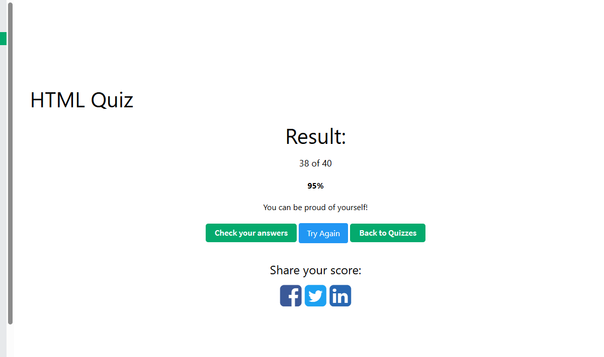

# HW1 Q&A
### 1. What is HTML?

HTML stands for HyperText Markup Language. It is the standard markup language used to structure content on the web. HTML defines the elements of a webpage. It focuses on the structure and content, not styling or behavior, which are handled by CSS and JavaScript.

### 2. What is the minimal structure of an HTML5 document?

The minimal structure of an HTML5 document includes the <!DOCTYPE html> declaration, an <html> element, a <head> section for metadata such as the title and character encoding, and a <body> section that contains the page content.

### 3. What is the purpose of the meta tag?

The meta tag is used to provide metadata about an HTML document, like page descriptions, character encoding, viewport settings. This information is not displayed on the page but helps browsers, search engines, and other tools correctly interpret, render, and optimize the webpage.

### 4. What is the difference between <head> and <header>

The <head> element contains metadata about the document, links to CSS, and scripts, and it is not displayed on the page. The <header> element is used within the page body to represent introductory or navigational content, such as headings, logos, or navigation menus, and it is visible to users.

### 5. What is the tag used for in HTML?

An HTML tag is used to define and structure elements within a webpage. They the fundamental building blocks for creating web. Tags tell the browser how different parts of the content should be interpreted and provides a foundation for styling with CSS and interaction with JavaScript.

### 6. Explain the following code <a href="http://example.com/sample_page/" rel="noreferrer nofollow">Link</a>

This code creates a hyperlink points to http://example.com/sample_page/. The href attribute specifies the destination URL. The rel attribute tells the browser not to send referrer information when the link is clicked and instructs search engines not to pass ranking or SEO credit to the linked page. The text “Link” is the clickable content shown to the user.

### 7. How do you serve your page in multiple languages?

To serve a page in multiple languages, I use internationalization by separating user-facing text into translation files and rendering content based on localee. I choose a clear URL strategy such as language subpaths (/en/, /zh/) or subdomains (en.example.com), and use the browser’s Accept-Language header to suggest a default language while still letting users switch manually. I also set the lang attribute on the <html> element and use hreflang to help search engines index the correct language version.

### 8. What are semantic HTML tags and why are they important?

Semantic HTML tags are elements that clearly describe their meaning and role in a webpage, such as <header>, <nav>, <main>, <section>, <article>, and <footer>.They are important because they make the code more readable and maintainable, enhance accessibility for screen readers, and help search engines better understand the structure and content of a page, which benefits SEO.

### Quiz_Result

